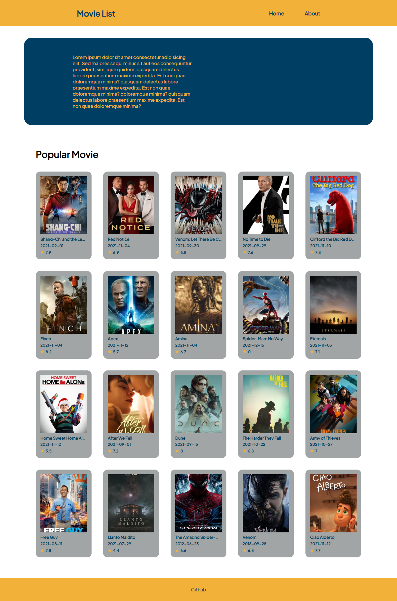

## Movie List Project

## About

<p>a project listing movies</p>

## Getting Started

- Clone the repository

```
git clone https://github.com/ahmetseha/movie-list-project.git
```

- Install NPM packages

```
yarn
```

## Running The Apps

In the project directory, you can run:

```
yarn start
```

<br/>

### Project Image


